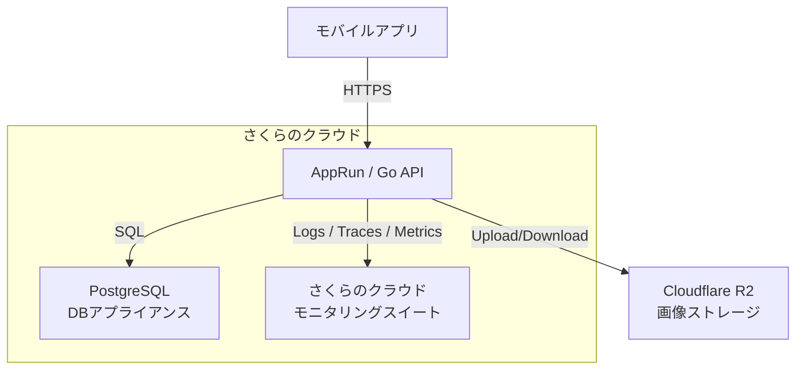

# ADR-001: 初期クラウド基盤として さくらのクラウド + AppRun を採用する

## Status

**Accepted**

## Date

2025-12-13

## Context（背景・課題）

本サービス（ゴミ問題を解決するモバイル向けサービス）は、以下の特性を持つ。

* 初期フェーズ（PMF前）であり、**利用規模・負荷は不確実**
* クライアントは **モバイルアプリ**
* 主な機能は

  * 写真付き投稿
  * 位置情報付きデータ登録
  * 閲覧・集計API
* 開発・運用リソースは限られており、**運用負荷を極力下げたい**
* 月額ランニングコストは **2万円以内** に抑えたい
* 日本リージョン前提、国内法・運用・請求の分かりやすさを重視

このため、以下の点が重要な意思決定軸となった。

* 初期構築と運用がシンプルであること
* スケールや構成変更が **後から段階的に可能** なこと
* 観測性（ログ・トレース）が初期から確保できること
* 早期に「作る価値の検証」に集中できること

---

## Decision（決定）

### 採用する構成

* **APIサーバー**

  * さくらのクラウド **AppRun**
  * Go言語によるAPI実装
* **データベース**

  * さくらのクラウド **DBアプライアンス（PostgreSQL）**
  * VMは使用せず、DB性能に直接投資する
* **画像ストレージ**

  * Cloudflare R2（または将来的にさくらのオブジェクトストレージ）
* **監視・観測**

  * さくらのクラウド **モニタリングスイート**
  * Go + OpenTelemetry によるログ・トレース・メトリクス収集
* **VM（Redis / Otel Collector / Worker）**

  * **初期フェーズでは構築しない**

---

## Architecture（構成図）

---

## Rationale（理由）

### AppRun を採用した理由

* VM管理（OS・セキュリティ・スケール）を不要にできる
* コンテナデプロイが容易で、Goとの相性が良い
* 初期負荷では **共用型で十分** な性能とコストバランス
* 将来的に専有型・VM構成へ移行可能

### DBを太くし、VMを持たない理由

* 初期ボトルネックは **APIよりDBになる可能性が高い**
* Redisや非同期処理は **初期段階では不要**
* VMを減らすことで

  * 運用負荷
  * 障害要因
  * 設計複雑度
    を下げられる
* DBアプライアンスは

  * バックアップ
  * パラメータ調整
    をマネージドで任せられる

### モニタリングスイートを採用した理由

* OpenTelemetry（Logs / Traces / Metrics）に対応
* 自前で

  * Grafana
  * Loki
  * Tempo
    を構築・運用する必要がない
* AppRun環境から **直接エクスポート可能**
* 初期フェーズで必要な

  * エラー率
  * レイテンシ
  * ボトルネック把握
    を十分に満たす

---

## Consequences（結果・影響）

### ポジティブ

* 初期構成が非常にシンプル
* 月額コストを **1万円前後** に抑えられる
* 観測性を犠牲にせず、開発に集中できる
* 将来の拡張（Redis / Worker / Collector）が容易

### ネガティブ / トレードオフ

* Redisキャッシュがないため

  * 高頻度アクセス時はDB負荷が増える
* 複雑な非同期処理には向かない
* 監視の自由度はフル自前構成より低い

※ いずれも **PMF前フェーズでは許容可能** と判断

---

## Alternatives Considered（検討したが採用しなかった案）

### VM中心構成（API + Redis + Otel Collector）

* ❌ 運用負荷が高い
* ❌ 初期段階では過剰
* ❌ 障害ポイントが増える

### フルマネージド海外クラウド（GCP / AWS）

* ❌ 月額コストが読みにくい
* ❌ 国内請求・運用の煩雑さ
* ❌ 初期検証にはオーバースペック

---

## Future Considerations（将来の拡張余地）

以下は **負荷や要件が明確になった段階で追加** する。

* Redis（キャッシュ / rate limit）
* バックグラウンドワーカー（画像解析・集計）
* Otel Collector（複数サービス化）
* AppRun専有型 or VM移行

---

## Summary（要点まとめ）

* **「作る価値の検証」に最大限集中する構成**
* 初期フェーズでは

  * シンプル
  * 安い
  * 観測可能
    が最優先
* 技術的負債を作らず、将来の拡張余地を残す判断

---

もし次に進むなら、

* このADRを **README / docs/adr/001-cloud-architecture.md** に落とす
* 「Redis追加」「VM追加」時の **ADR-002, 003** をテンプレ化

までやると、かなり強い設計ドキュメントになります。

👉 **ADRテンプレ（Markdown雛形）も用意しますか？**
